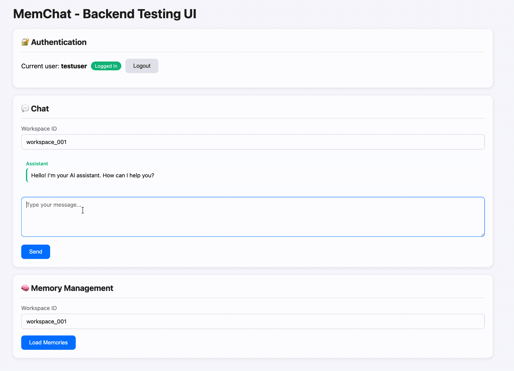

<div align="center">

# 🧠 MemChat

**Production-Ready Multi-Tenant AI Memory System**

A secure, scalable backend for building AI applications with persistent memory and strict user data isolation.

[](https://www.typescriptlang.org/)
[](https://expressjs.com/)
[](https://milvus.io/)
[](LICENSE)

[Quick Start](#-quick-start) · [Features](#-features) · [Architecture](#-architecture) · [API Docs](#-api-endpoints)

</div>

---

## 🎯 Why MemChat?


Building AI apps with memory is hard. Building **multi-tenant** AI apps with memory is harder.

**Common challenges:**

- ❌ Data isolation between users is complex and error-prone
- ❌ Vector databases grow indefinitely, storing irrelevant conversations
- ❌ RAG systems need memory, but how do you manage it?
- ❌ Security vulnerabilities from improper tenant isolation

**MemChat solves all of these out of the box:**

- ✅ **Dual-layer isolation** - JWT + database-level enforcement
- ✅ **Smart memory** - LLM evaluates what's worth remembering
- ✅ **RAG-ready** - Semantic search over conversation history
- ✅ **Production-grade** - TypeScript, error handling, Docker-ready

---

## 🎬 Demo

<div align="center">



**Your AI assistant that truly remembers**

</div>

### ✨ Persistent Memory Across Sessions

The core power of MemChat: **No matter where or when you restart a conversation, your AI assistant remembers.**

**Real-world scenario:**

```
📝 Day 1, Workspace "work":
User: "I prefer using TypeScript for backend development"
AI:  "Got it! I'll remember you prefer TypeScript..."

📝 Day 3, Workspace "work" (new session):
User: "What language should I use for my new API project?"
AI:  "Based on your preference for TypeScript, I'd recommend..."
     ↑ Automatically retrieved from memory!

📝 Day 7, Workspace "personal" (different context):
User: "Suggest a backend stack for my side project"
AI:  "Since you prefer TypeScript, consider Express or NestJS..."
     ↑ Same user, different workspace, still remembers!
```

**Key capabilities:**

- 🔄 **Cross-session persistence** - Memories survive server restarts
- 🎯 **Contextual retrieval** - Relevant memories fetched automatically via semantic search
- 🏢 **Multi-workspace support** - Separate contexts for work, personal, projects, etc.
- 👤 **User isolation** - Each user's memories are completely private

---

## 🚀 Features

### 🔐 Enterprise-Grade Multi-Tenancy

**Two-layer isolation guarantee:**

```
┌─────────────────────────────────────────────────────────┐
│  Layer 1: JWT Authentication Middleware                 │
│  - Extracts user_id from token                          │
│  - Rejects unauthenticated requests                     │
└─────────────────────────────────────────────────────────┘
                          │
                          ▼
┌─────────────────────────────────────────────────────────┐
│  Layer 2: Milvus Partition Key Enforcement              │
│  - user_id is Partition Key                             │
│  - All queries filtered by user_id                      │
│  - Impossible to access another user's data             │
└─────────────────────────────────────────────────────────┘
```

**Security guarantee:** Even if auth middleware is bypassed, data layer prevents unauthorized access.

### 🧠 Intelligent Memory System

```
User Message ──► LLM evaluates importance ──► Store if valuable
                      │
                      ▼
              "User prefers dark mode"
              "User works at TikTok"
              "User likes Chinese food"
                      │
                      ▼
              Stored in Milvus with embeddings
                      │
                      ▼
              Retrieved in future conversations (RAG)
```

- **Automatic evaluation** - LLM decides what's worth remembering
- **Semantic retrieval** - Find relevant memories by meaning, not keywords
- **Workspace isolation** - Same user, different contexts (work/personal/etc.)

### 🎯 Developer Experience

```bash
# 1. Start infrastructure
docker-compose up -d

# 2. Install & run
npm install && npm run dev

# 3. Open browser
open http://localhost:3000  # Interactive testing UI included!
```

---

## 🏗️ Architecture

```
┌──────────────────────────────────────────────────────────────────┐
│                         Client / Frontend                         │
└──────────────────────────────────────────────────────────────────┘
                                │
                                ▼
┌──────────────────────────────────────────────────────────────────┐
│                      Express.js Server                            │
│  ┌────────────────┐  ┌────────────────┐  ┌────────────────┐     │
│  │ Auth Middleware│  │  Controllers   │  │    Routes      │     │
│  │   (JWT Verify) │  │  (Business)    │  │   (Endpoints)  │     │
│  └────────────────┘  └────────────────┘  └────────────────┘     │
└──────────────────────────────────────────────────────────────────┘
                                │
          ┌─────────────────────┼─────────────────────┐
          ▼                     ▼                     ▼
┌──────────────────┐  ┌──────────────────┐  ┌──────────────────┐
│   LLM Service    │  │ Memory Service   │  │ Embedding Service│
│  (OpenAI API)    │  │  (Memory Mgmt)   │  │  (Local Model)   │
└──────────────────┘  └──────────────────┘  └──────────────────┘
                                │
                                ▼
                    ┌──────────────────┐
                    │     Milvus       │
                    │  (Vector Store)  │
                    └──────────────────┘
```

---

## 📦 Quick Start

### Prerequisites

- Node.js 18+
- Docker & Docker Compose
- OpenAI API key (or compatible endpoint)

### Installation

```bash
# Clone the repository
git clone https://github.com/your-username/memchat.git
cd memchat

# Start Milvus (vector database)
docker-compose up -d

# Install dependencies
npm install

# Configure environment
cp .env.example .env
# Edit .env with your API keys

# Start development server
npm run dev
```

Visit `http://localhost:3000` for the interactive testing UI.

### Environment Variables

```env
# Server
PORT=3000
NODE_ENV=development

# JWT
JWT_SECRET=your-super-secret-key

# Milvus
MILVUS_ADDRESS=localhost:19530

# LLM (OpenAI compatible)
LLM_API_KEY=your-api-key
LLM_BASE_URL=https://api.openai.com/v1
LLM_MODEL=gpt-4
LLM_EMBEDDING_MODEL=text-embedding-ada-002
```

---

## 📖 API Endpoints

### Authentication

<details>
<summary><code>POST /api/auth/register</code> - Register User</summary>

```bash
curl -X POST http://localhost:3000/api/auth/register \
  -H "Content-Type: application/json" \
  -d '{"username": "alice"}'
```

**Response:**

```json
{
  "userId": "550e8400-e29b-41d4-a716-446655440000",
  "username": "alice",
  "token": "eyJhbGciOiJIUzI1NiIs..."
}
```

</details>

<details>
<summary><code>POST /api/auth/login</code> - Login</summary>

```bash
curl -X POST http://localhost:3000/api/auth/login \
  -H "Content-Type: application/json" \
  -d '{"username": "alice"}'
```

</details>

### Chat

<details>
<summary><code>POST /api/chat</code> - Send Message</summary>

```bash
curl -X POST http://localhost:3000/api/chat \
  -H "Authorization: Bearer YOUR_TOKEN" \
  -H "Content-Type: application/json" \
  -d '{
    "workspaceId": "work-project",
    "message": "I prefer TypeScript for backend development"
  }'
```

**Response:**

```json
{
  "response": "I'll remember that you prefer TypeScript...",
  "memoriesUsed": 2,
  "memoriesStored": 1
}
```

**Flow:**

1. Retrieves relevant memories using vector search
2. Builds context-aware prompt
3. Calls LLM for response
4. Evaluates if message is worth remembering
5. Stores valuable information in Milvus

</details>

### Memory Management

<details>
<summary><code>GET /api/memories?workspaceId=xxx</code> - List Memories</summary>

```bash
curl "http://localhost:3000/api/memories?workspaceId=work-project" \
  -H "Authorization: Bearer YOUR_TOKEN"
```

**Response:**

```json
{
  "count": 3,
  "memories": [
    {
      "id": "memory-uuid",
      "content": "User prefers TypeScript for backend",
      "score": 0.85
    }
  ]
}
```

</details>

<details>
<summary><code>PUT /api/memories/:id</code> - Update Memory</summary>

```bash
curl -X PUT http://localhost:3000/api/memories/memory-uuid \
  -H "Authorization: Bearer YOUR_TOKEN" \
  -H "Content-Type: application/json" \
  -d '{"content": "Updated content"}'
```

</details>

<details>
<summary><code>DELETE /api/memories/:id</code> - Delete Memory</summary>

```bash
curl -X DELETE http://localhost:3000/api/memories/memory-uuid \
  -H "Authorization: Bearer YOUR_TOKEN"
```

</details>

---

## 🛠️ Tech Stack

| Component            | Technology                   |
| -------------------- | ---------------------------- |
| **Runtime**    | Node.js + TypeScript         |
| **Framework**  | Express.js                   |
| **Vector DB**  | Milvus 2.4                   |
| **Embeddings** | @xenova/transformers (local) |
| **LLM**        | OpenAI API (or compatible)   |
| **Auth**       | JWT                          |
| **Container**  | Docker Compose               |

---

## 📁 Project Structure

```
src/
├── config/           # Configuration management
├── middlewares/      # JWT authentication
├── services/
│   ├── milvus.service.ts      # Vector DB operations
│   ├── embedding.service.ts   # Text embeddings
│   ├── llm.service.ts         # LLM integration
│   └── memory.service.ts      # Memory logic
├── controllers/      # Request handlers
├── routes/           # API routes
├── types/            # TypeScript definitions
└── utils/            # Helpers
```

---

## 🔒 Security Best Practices

1. **Never trust client input** - All user_id from JWT, not request body
2. **Defense in depth** - Auth middleware + database partition key
3. **No plaintext secrets** - Environment variables only
4. **Input validation** - Type checking on all endpoints

---

## 🗺️ Roadmap

- [ ] Streaming responses (SSE)
- [ ] Memory expiration policies
- [ ] Multi-modal memory (images, files)
- [ ] Memory summarization for long conversations
- [ ] Admin dashboard
- [ ] Rate limiting
- [ ] Redis caching layer

---

## 🤝 Contributing

Contributions are welcome! Please read our [Contributing Guide](CONTRIBUTING.md) for details.

1. Fork the repository
2. Create your feature branch (`git checkout -b feature/amazing-feature`)
3. Commit your changes (`git commit -m 'Add amazing feature'`)
4. Push to the branch (`git push origin feature/amazing-feature`)
5. Open a Pull Request

---

## 📄 License

This project is licensed under the MIT License - see the [LICENSE](LICENSE) file for details.

---

## 🙏 Acknowledgments

- [Milvus](https://milvus.io/) - High-performance vector database
- [Transformers.js](https://huggingface.co/docs/transformers.js) - Local embeddings
- [OpenAI](https://openai.com/) - LLM capabilities

---

<div align="center">

**⭐ If this project helped you, please give it a star! ⭐**

[Report Bug](https://github.com/your-username/memchat/issues) · [Request Feature](https://github.com/your-username/memchat/issues)

</div>
